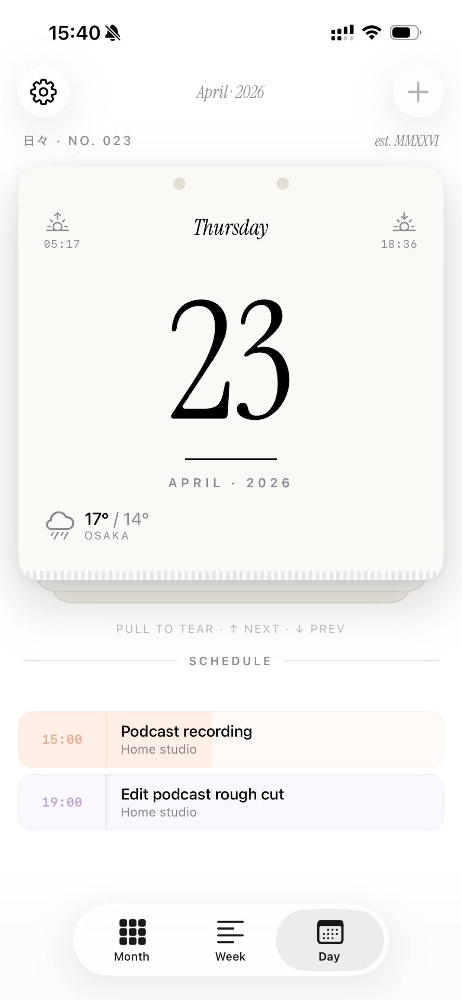
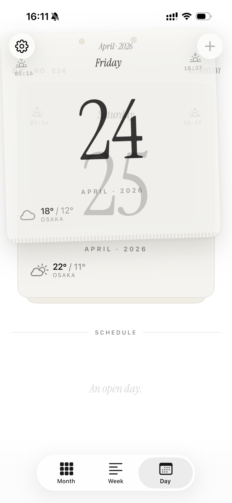
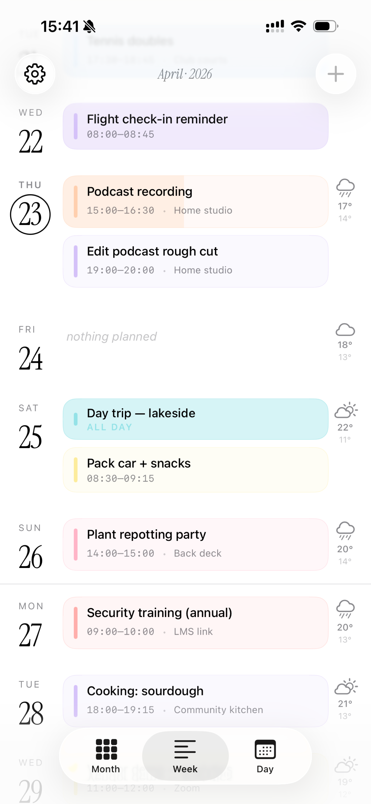
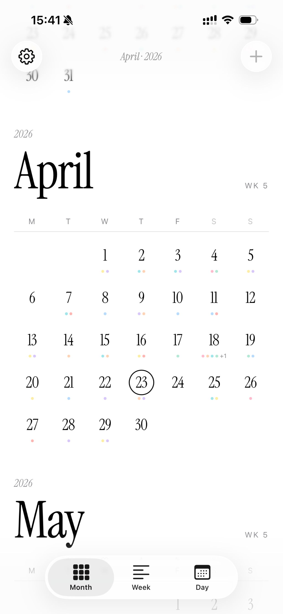

# Hibi

A personal calendar app for iOS with an editorial, paper-stationery aesthetic.

<p align="center">
  
  
  
  
</p>

## Download

Coming soon on the App Store.

<!-- [](https://apps.apple.com/app/hibi/id000000000) -->

## Features

- **Day view** — tear-off paper-pad with drag-to-rip navigation and haptic feedback
- **Week view** — infinite scrolling day stream with event cards
- **Month view** — dot-coded calendar grid with infinite scroll
- **Weather** — daily forecast and sunrise/sunset via WeatherKit
- **Localized** — English, German, and Japanese
- **Privacy-first** — no accounts, no tracking, no servers; all data stays on-device

## Requirements

- iOS 26.0+
- Xcode 26+

## Setup

```sh
git clone https://github.com/AlexW00/hibi.git
cd hibi
./scripts/bootstrap.sh   # copies Local.xcconfig template + installs git hooks
```

Open `Local.xcconfig` and set your Apple Developer team ID, then open `Hibi.xcodeproj` and build.

## Privacy

See [PRIVACY_POLICY.md](PRIVACY_POLICY.md).

## License

All rights reserved.
